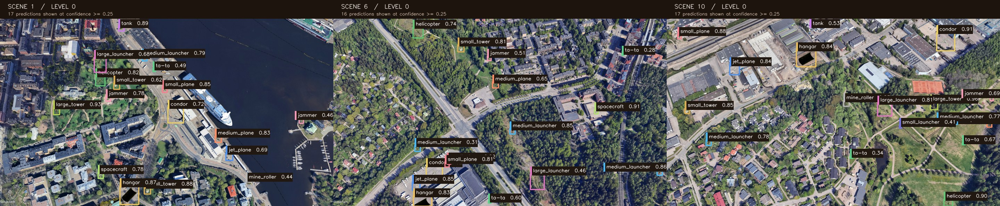
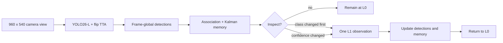

# AeroGaze

**A wide-angle detector that knows when to look closer.**

[](https://github.com/Kevinsvip888/aerogaze-drone-flyby/actions/workflows/tests.yml)
[](LICENSE)
[](https://huggingface.co/Invisible-dog/aerogaze-yolo26l)
[](https://www.python.org/)

AeroGaze combines a YOLO26-L aerial-object detector, Kalman position memory,
camera-motion compensation, and a conservative L0/L1 inspection policy. It was
built for the Nordic AI Cup Drone Flyby task, where every response is scored
against the full 3840 x 2160 source frame even when the camera is looking at a
smaller crop.



<p align="center"><sub>
Qualitative L0 outputs on three synthetic development composites. Boxes use a
0.25 display threshold. These images were part of model development and are not
held-out benchmark evidence.
</sub></p>

## The idea

A detector can gain detail by zooming in, but every close look hides the rest
of the scene. AeroGaze treats zoom as a short inspection rather than a default
mode. It observes the full frame, remembers reliable objects, predicts their
motion while the camera is away, and returns to the overview after one L1
frame.



| Component | Recorded release behavior |
|---|---|
| Perception | YOLO26-L at 1280 input with FP16 and four-flip top-two fusion |
| Coordinates | Crop-local detections are converted to normalized full-frame boxes |
| Memory | Per-object Kalman prediction, observation updates, uncertainty and visibility gates |
| Camera | At least three consecutive L0 observations before a one-frame L1 inspection |
| Priority | Same-object class changes first, then absolute confidence changes |
| Guardrails | No L2, immediate L1-to-L0 return, stale/off-frame tracks removed |

The policy intentionally excludes `ta-ta` and `small_launcher` from its final
experiment output. That is a recorded experiment choice, not a task or API
requirement.

## Why the memory matters

The API always expects the best prediction for the whole source frame. During
an L1 inspection, detections outside the crop can still be submitted if they
were observed earlier and their current positions can be estimated safely.
AeroGaze therefore keeps class identity and motion separate:

1. Confidence above 0.3 establishes short memory.
2. Confidence above 0.5 can retain identity until the track leaves the frame.
3. A new compatible detection corrects the Kalman state on every observation.
4. Unseen off-crop positions are emitted for at most two frames and only while
   uncertainty and visibility checks pass.

Memory reduces the cost of losing the overview; it cannot recover an object
that first appears outside the active crop.

## Repository map

```text
runtime/       detector, camera policy, tracking, protocol and local server
tools/         deployment-package builder and public-release audit
tests/         synthetic CPU regression tests; no weights or private data
docs/          results, notices and README assets
.github/       CPU test workflow
```

The main decision logic lives in `runtime/camera_policy.py`. Tracking is split
across `tracking.py`, `kalman_position.py`, and `visible_view_motion.py`.
`live_adapter.py` handles sequence isolation, duplicate requests, and causal
updates. The service entry point retains its historical `serve_b0.py` name.

## Quick start

CPU policy tests require no checkpoint or CUDA:

```sh
python -m pip install -r requirements-test.txt
python -m unittest discover -v
python tools/audit_release.py
```

For inference, install the CUDA build of PyTorch that matches your platform,
then install the recorded dependencies:

```sh
python -m pip install -r requirements.txt
```

Download the final L0 E50 checkpoint from
[AeroGaze YOLO26-L on Hugging Face](https://huggingface.co/Invisible-dog/aerogaze-yolo26l)
and save it as `weights/model.pt`. Build and verify the participant package:

```sh
python tools/build_package.py --checkpoint weights/model.pt --output build/participant
python build/participant/serve_b0.py --verify-only
python build/participant/serve_b0.py --host 127.0.0.1 --port 9054
```

The server exposes `GET /ready` and `POST /predict`. The frozen inference
configuration uses CUDA device 0 and FP16. It was tested with Python 3.12,
PyTorch 2.9.1+cu128, torchvision 0.24.1+cu128, and Ultralytics 8.4.155.

The package builder verifies the recorded checkpoint SHA256 and refuses to
overwrite an existing output directory. A different compatible checkpoint can
be supplied deliberately with `--expected-sha256`, but that does not establish
equivalent accuracy.

## Protocol details that are easy to get wrong

- The received 960 x 540 image is crop-local; returned boxes are normalized to
  the complete 3840 x 2160 source frame.
- The model must use the exact 16-class order in `runtime/dtos.py`.
- Model class scores are ranking scores, not calibrated probabilities.
- A valid response can contain tracked objects outside the current crop.
- Tracking must remain causal: later observations cannot repair earlier frames.

Optional request recording is explicit and should remain private:

```sh
python build/participant/serve_b0.py --record-dir recordings/session-001
```

The local service has no authentication. Keep the default loopback binding
unless access controls are provided by the surrounding deployment.

## Evidence and limitations

The final policy passed a 248-frame offline replay with 50 synthetic L1
observations and causal checks. It has no confirmed complete official
Validation score. The historical best confirmed official score,
`0.4950687646541436`, came from a different E40 fixed-L0 baseline and must not
be attributed to the final policy.

The offline replay uses interpolated crops from stored L0 images rather than
true high-resolution L1 source crops. The included tests exercise camera
cadence, priority, Kalman correction, motion failure, off-crop memory, exits,
duplicate requests, out-of-order frames, and sequence isolation. They do not
measure detector quality or real-time performance on other hardware. See the
[recorded results](docs/RESULTS.md) for the exact evidence boundary.

This repository is a compact post-competition extraction of the final
inference and policy code. Training data, competition recordings, credentials,
historical experiments, and model weights are not stored here.

## License

Source code is released under the [MIT License](LICENSE). Dependencies, model
weights, and source imagery retain their own licenses.
